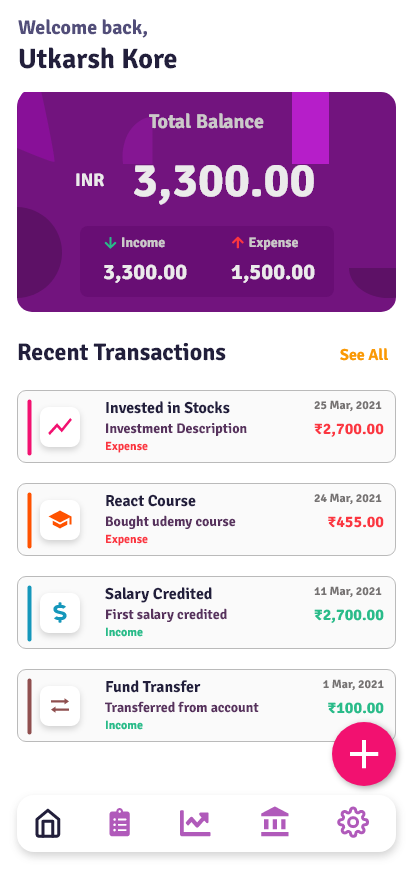
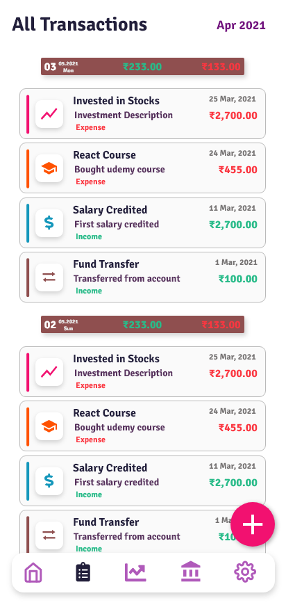
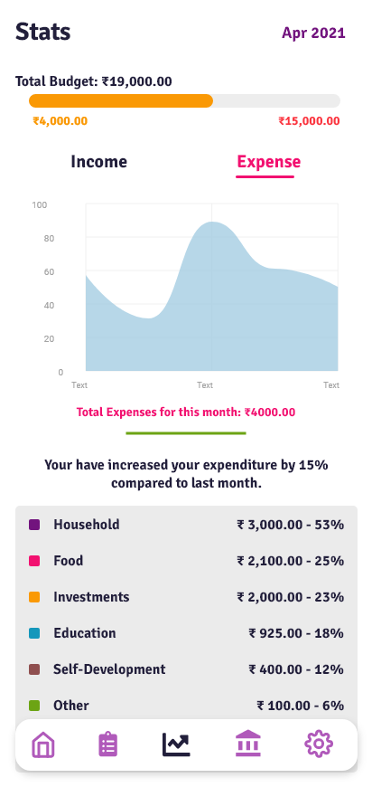

## Fiscal
##### Don't save your money, Invest it
Fiscal is a simple money manager application for managing and controlling budget. Project uses Flutter Framework. Some Key Features include:
* Track income and expense daily.
* View statistics for expense patterns through charts.
* Manage budget and accounts. 

## Design
#### Some of the glimpse from design:

Follow me on [LinkedIn](https://www.linkedin.com/in/utkarsh-kore-175080174/)
Thanks, Happy Coding!

>The project is under active development.